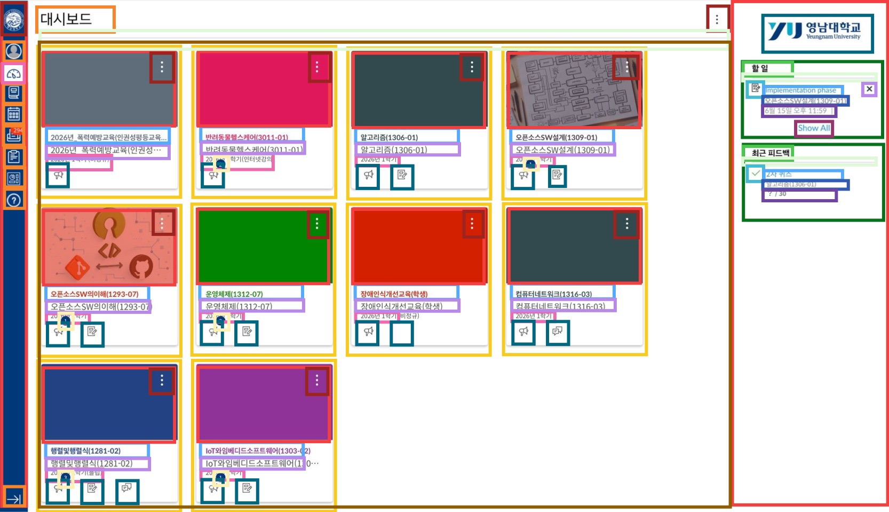
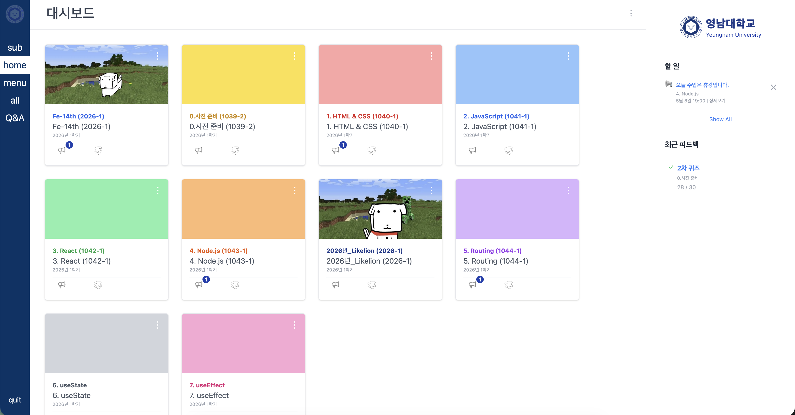

# 14th-fe-assignment-5
영남대 멋쟁이사자처럼 14기 프론트엔드 트랙 5차시 과제

* * *
### 레퍼런스용 웹페이지 구조분석



---

### 완성본



* * *
# 신경 써서 구현한 부분
1. 레이아웃 구성 및 텍스트나 이미지가 레이아웃을 넘쳐 깨지는 경우를 방지하려고 했습니다. 
2. 호버를 이용했습니다.
- 목록(리스트)에서 커서를 올렸을때
- 특히, 메인 대시보드에서 카드의 그림자 효과 및 텍스트 밑줄을 구현해 봤습니다.   

- +       
3. 메인보드 구성에 맵을 활용했습니다.
* *  *
# 질문
 ```
 const DashboradList = [
    { id: 1, thumbnail: dashboardimages2, icon: write,profile: notice, title: "Fe-14th (2026-1)", semester: "2026년 1학기", textColor: "text-blue-600", unread: true },
    { id: 2, color: "bg-yellow-300", icon: write, profile: notice, title: "0.사전 준비 (1039-2)", semester: "2026년 1학기", textColor: "text-yellow-600", unread: false },
    { id: 3, color: "bg-red-300", icon: write, profile: notice, title: "1. HTML & CSS (1040-1)", semester: "2026년 1학기", textColor: "text-red-600", unread: true },
    { id: 4, color: "bg-blue-300", icon: write, profile: notice, title: "2. JavaScript (1041-1)", semester: "2026년 1학기", textColor: "text-blue-600", unread: false },
    { id: 5, color: "bg-green-300", icon: write, profile: notice, title: "3. React (1042-1)", semester: "2026년 1학기", textColor: "text-green-600", unread: false },
    { id: 6, color: "bg-orange-300", icon: write, profile: notice, title: "4. Node.js (1043-1)", semester: "2026년 1학기", textColor: "text-orange-600", unread: true },
    { id: 7, thumbnail: dashboardimages1, icon: write, profile: notice, title: "2026년_Likelion (2026-1)", semester: "2026년 1학기", textColor: "text-blue-900", unread: false },
    { id: 8, color: "bg-purple-300", icon: write, profile: notice, title: "5. Routing (1044-1)", semester: "2026년 1학기", textColor: "text-purple-600", unread: true },
    { id: 9, color: "bg-gray-300", icon: write, profile: notice, title: "6. useState", semester: "2026년 1학기", textColor: "text-gray-600", unread: false },
    { id: 10, color: "bg-pink-300", icon: write, profile: notice, title: "7. useEffect", semester: "2026년 1학기", textColor: "text-pink-600", unread: false },]; 
```

1. 해당하는 코드는 제가 작성한 메인 대시보드 중 각각의 대시보드를 위한 맵 코드 입니다.  
     제가 생각하기에 복잡하다고 느껴지는데 이것을 속성에 따라 구별해서 맵을 작성하는 방법도 있을지 궁금합니다.
```

 <div className="flex-1 text-[20px] w-16">
                <div className="  hover:bg-[#004080] bg-[#003366] flex items-center justify-center py-1">sub</div>   
                <div className=" bg-white text-[#003366] flex items-center justify-center py-1">home</div> 
                <div className=" hover:bg-[#004080] bg-[#003366] flex items-center justify-center py-1">menu</div>   
                <div className=" hover:bg-[#004080] bg-[#003366] flex items-center justify-center py-1">all</div>   
                <div className=" hover:bg-[#004080] bg-[#003366] flex items-center justify-center py-1">Q&A</div>   
            </div>
```
2. 해당 코드는 맵을 사용하면 좋을 사례 였을지 궁금합니다. 같은 내용이 4개 정도 되면 맵을 사용해서 반복하는 내용을 줄이는게 좋을까요?
